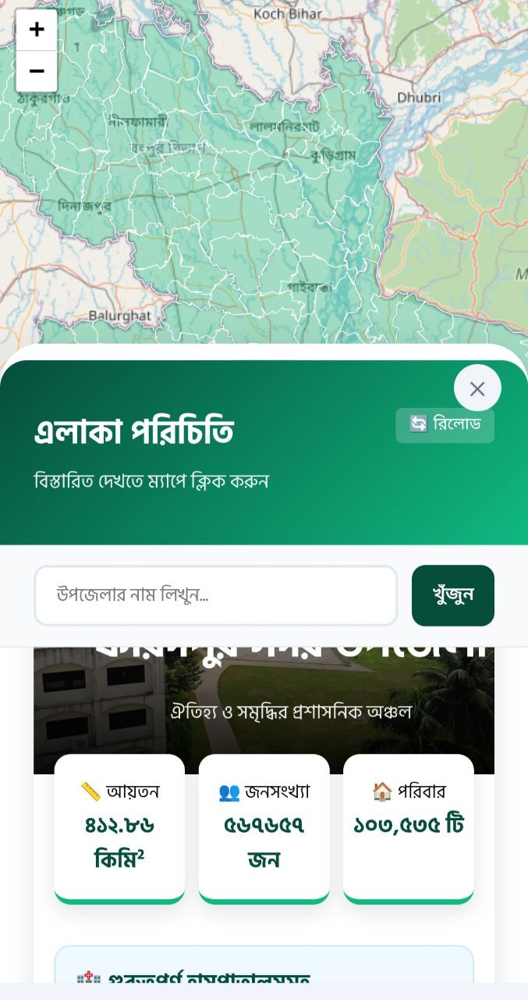

# 🌍 Community Atlas: A Hyper-Local Interactive Dashboard

**Community Atlas** is a dynamic, data-driven platform designed to centralize and democratize access to **sub-district (Upazila)–level information across Bangladesh**. By transforming static map data into a **“Live Area Wiki,”** it provides a 360-degree view of local communities—serving as a vital resource for **residents, tourists, students, and researchers**.

---

## 📌 The Core Problem

In the context of Bangladesh, accessing reliable hyper-local information remains challenging due to:

- **Dispersed Local Data**  
  Important Upazila-level information is scattered across multiple sources and difficult to retrieve in one place.

- **Mapping Gaps**  
  Standard platforms (e.g., Google Maps) lack comprehensive local details such as hospitals, emergency contacts, clubs, and localized news.

- **Language Barrier**  
  Much of the available digital data is primarily in English, limiting accessibility for Bengali-speaking users.

- **Tourist Challenges**  
  Travelers often struggle to find dependable destinations, services, and emergency resources at the local level.

---

## 🚀 Key Technical Features

Community Atlas leverages a powerful **API Mashup & Scraping Engine** to synchronize multiple data sources in near real time:

### 🗺️ Interactive Mapping
- Built with **Leaflet.js**
- Seamless GeoJSON rendering for fluid, responsive interaction
- One-click Upazila selection triggers contextual data loading

### 📊 Data Scraping & Aggregation
- Uses the **Wikipedia API** to extract:
  - Area
  - Population
  - Number of households
- Dynamically parses structured and unstructured content

### 🌐 Smart Localization
- Instant **English → Bangla translation** via Google Translate API
- Ensures accessibility for native Bengali users

### 📡 Dynamic Information Modules
- **Live Weather**  
  Powered by **Open-Meteo API** (temperature, local time)

- **Localized News**  
  Google News RSS feeds filtered by the selected Upazila

- **Educational Hub**  
  Displays notable schools, colleges, and universities

- **Hall of Fame**  
  Lists notable people (politicians, writers, scientists, etc.) from the region

- **Emergency SOS**  
  Direct call buttons for:
  - Hospitals
  - Emergency services (999)
  - Local health facilities

---

## 💻 Tech Stack

### Frontend
- **HTML5**
- **CSS3**
- Mobile-friendly sidebar with touch-drag UI
- Responsive design optimized for small screens

### Backend
- **PHP**
  - API handling
  - Data scraping
  - Content processing and formatting

### Libraries
- **Leaflet.js** – Interactive mapping
- **Turf.js** – Spatial analysis and geographic utilities

### APIs & Data Sources
- **Wikipedia API** – Area data & images
- **Open-Meteo API** – Live weather
- **Google News RSS** – Local news
- **Google Translate API** – Localization

---

## 📱 User Experience

Designed around the philosophy of **“One Click, All Info”**:

1. User clicks an Upazila on the interactive map  
2. Sidebar dynamically loads:
   - Overview & statistics
   - Weather
   - News
   - Education
   - Notable people
   - Emergency contacts

The interface is fully optimized for **mobile devices**, featuring:
- Smooth animations
- Custom touch-drag sidebar logic
- Clean, readable Bangla typography

---

## 🛤️ Future Roadmap & Impact

### 🔧 Planned Enhancements
- **Community Contributions**  
  Enable locals to submit and update information, fostering a community-driven knowledge base.

- **Advanced Analytics**  
  Integrate demographic, economic, and development indicators.

- **Educational Expansion**  
  Serve as a reference platform for students, educators, and researchers.

- **Performance Optimization**  
  Implement caching to ensure near-instant data loads after the first fetch.

---

## 🌱 Social Impact

Community Atlas aims to:
- Bridge information gaps at the grassroots level  
- Empower citizens with accessible local knowledge  
- Support tourism and regional discovery  
- Promote digital inclusion through Bangla-first design  

---

## 👤 Author

**Presented by:**  
**Wাহিদুর রহমান ফারহান (Wahidur Rahman Farhan)**

---

If you find this project useful or inspiring, consider starring the repository ⭐ and sharing feedback!

